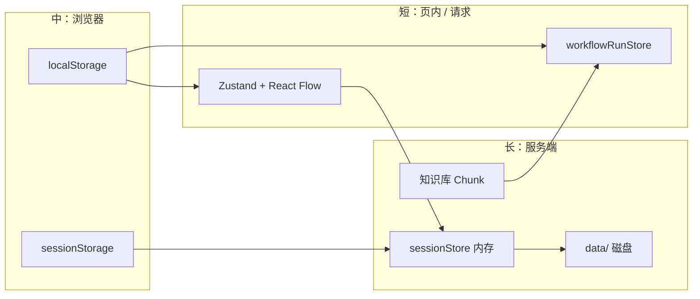

# Kronos Agent

探索 LLM 原理与 Agent Workflow 的前端主导项目，目标是让前端工程师能用可视化手段掌握并落地 AI Agent 系统（对标 Dify 类平台的产品形态）。

Playground、知识库、Workflow 编辑器共用 JWT 与模型接入；**「记住什么」分散在不同寿命的载体里**——从关页即失的 UI 状态，到磁盘上的会话与知识库，请求时再按需拼装进上下文。

---

## 记忆与状态分层（本项目摘要）

类似 IDE / Agent 产品里的多层上下文，本仓库**没有单一「记忆服务」**，而是按 **寿命 × 载体** 分工。下表按「从短到长」排列，便于对照代码。

| 寿命 | 记什么 | 载体 / 模块 | 典型用途 |
| --- | --- | --- | --- |
| **请求内** | 当次 SSE 流、timeline 事件、编排中的临时变量 | `playgroundStore` 流式字段；`workflowRunStore` 单次 run；React Flow `nodes[].data` | 流式 UI、画布运行高亮、`_lastRun` |
| **页签 / 进程** | 当前对话列表、未落库的输入、画布未保存的交互态 | Zustand（`playgroundStore`、`workflowDraftStore`）；React Flow 内存图 | 刷新前编辑体验；`backupDraft` 防误关 |
| **浏览器 session** | 当前 Playground 会话 id、首页选中的假发布 Chatbot | `sessionStorage`：`kronos_session_id`、`kronos_playground_published_chatbot_app_id` | 同页签刷新续聊；关页签后新会话 |
| **浏览器持久** | 自建 Workflow DSL、缩略图、示例假发布、知识库列表刷新戳 | `localStorage`（见下表） | 离线草稿、列表预览、只读示例的发布标记 |
| **服务端热数据** | 对话全文、滚动摘要、运行记录索引 | 内存 `Map`：`sessionStore`、`workflowRunStore`（run 默认 TTL 30min） | 多轮对话与调试 API |
| **服务端冷数据** | 会话落盘、知识 Chunk、编排示例、缩略图文件 | `apps/server/data/` 下 `sessions/`、`knowledge-datasets/`、`workflow-examples/`、`workflow-draft-previews/` 等 | 重启恢复、RAG 检索、内置示例 |



### 对话上下文如何拼装（Playground）

每轮 `POST /api/chat-stream` 前，服务端 `createMemoryPlan`（`apps/server/src/memory/`）在**不二次调模型做摘要**的前提下：

1. 从 `sessionStore` 取全量消息；条数 ≥ 12 时把较早对话压进 **滚动摘要** `memorySummary`；
2. 按 token 预算（约 32k 窗口 × 60% 输入预算 − 预留输出）从最近 8 条里**反选**能塞进模型的 history；
3. 若首页选了假发布 Chatbot，再叠加 **Workflow 编排**（系统提示、变量）与 **RAG 检索片段**（有 `dataset_ids` 时）。

前端 `MemorySummaryPanel` / `playgroundStore.memoryMetrics` 展示摘要与估算 token，便于对照「模型实际看到什么」。

### 编排与运行分别记在哪

| 类型 | 内容 | 存储 |
| --- | --- | --- |
| **编排稿** | 节点 DSL、Chatbot prompt、检查清单依赖的配置 | 自建：`localStorage` `kronos_workflow_apps_v1`；内置示例：服务端 `workflow-examples/`（只读）+ 可选 `kronos_workflow_example_mock_publish_v1` 覆盖假发布 |
| **编排元数据** | 列表缩略图、草稿更新时间 | `kronos_workflow_draft_preview_v1:{appId}`；可选同步 `workflow-draft-previews/` |
| **运行痕迹** | 单节点调试 I/O、整图 draft-run 事件 | API 写入 `workflowRunStore`；SSE 回写画布 `_runStatus` / `_lastRun`（刷新画布仍在，换机不在） |

### 浏览器 localStorage 键（Workflow 相关）

| 键 | 用途 |
| --- | --- |
| `kronos_workflow_apps_v1` | 自建应用 DSL、`mockPublished` |
| `kronos_workflow_draft_preview_v1:{appId}` | 列表缩略图（与主 JSON 分离，避免配额撑爆） |
| `kronos_workflow_example_mock_publish_v1` | 只读内置示例的假发布（不写服务端示例 JSON） |

---

## Workflow 编排与调试（近期）

路由：`/workflow` 列表 → `/workflow/draft?appId=` 画布 → `/workflow/config?appId=` Chatbot 配置。

### 测试运行（整图）

- 顶部 **「测试运行」**：不再弹模态框；检查清单不通过时打开首个问题节点的 Panel 并展示 blocker。
- 校验通过：第一次打开 **开始节点** 的「上次运行」Tab 填写输入；再次点击同一触发节点上的「测试运行」执行 `draft-runs`（SSE）。
- 开始节点通过 `WorkflowDraftTestRunProvider` 注册 `getDraftRunInputs`。

### 单节点调试

- 画布节点 **▶**：先校验 → 失败则打开 Panel（设置 Tab + blocker）；通过则切到「上次运行」并调用 `POST /api/workflow/debug/node`。
- Panel **「运行调试」**：Start / LLM / End / IfElse / 知识检索等面板；异步请求期间 **转圈 +「调试中…」**（`PanelRunDebugButton`）。
- Start 节点：调试表单必填与 JSON/数字格式校验，字段下红色 inline 错误；成功后「上次运行」展示输入/输出。
- 鉴权：调试与 draft-run 请求统一走 `buildWorkflowAuthHeaders`（与知识库 dev token 一致）。

### 发布（本地）

- 草稿页工具栏：**测试运行 | 发布 | 检查清单**（`WorkflowMockPublishButton`）。
- 自建应用：写入 `kronos_workflow_apps_v1` 的 `mockPublished`；列表显示绿色已发布勾。
- **只读内置示例**：画布 DSL 仍只读，但允许假发布；状态写入 `kronos_workflow_example_mock_publish_v1`。
- Chatbot 配置页复用同一发布按钮；Playground 可选已假发布的 Chat 应用走 RAG 增强（见 `publishedChatbotPlaygroundPrompt`）。

### 只读示例

- `GET /api/workflow/examples` 加载内置 DSL；画布锁定编辑，支持查看、测试运行、单节点调试、假发布标记。

主要前端目录：`apps/web/src/domains/workflow/editor/`（`draft-page/`、`compts/`、`hooks/use-node-debug-run.ts`）。

---

## 知识库与 RAG

面向产品的能力如下；**自研检索与 LangChain 检索视为同一产品能力**：由服务端 `RAG_ENGINE_MODE` 切换实现路径，**同一套 REST 契约与工作流配置页**，前端 `/rag` 与编排侧无分支 UI。实现细节与和 Dify 能力逐项对照见 [`docs/RAG_Prod_capability.md`](docs/RAG_Prod_capability.md)。

| 能力 | 说明 |
| --- | --- |
| **入口** | 前端 [`/rag`](http://localhost:5173/rag)（壳导航「知识库」）：数据集 CRUD、按库导入、文档列表、Chunk 浏览与块级 **关键词** 编辑。 |
| **文档与切片** | 上传/拖拽与批量导入、预处理规则、分段长度与重叠；导入前 **切片预估预览**。 |
| **检索** | 多库、Top K、阈值、元数据过滤、混合检索；可选 **多问句改写**（`RAG_LC_MULTI_QUERY`）。 |
| **工作流侧** | 知识检索节点、Chatbot `config-page` 与 `chatbot-prompt-editor`。 |
| **健康度与快照** | `GET …/health`、数据集快照 API。 |
| **对比与评测** | compare / evaluate API（前端 `features/rag/api`）。 |

### 产品界面（`static/`）

| 场景 | 截图 |
| --- | --- |
| **知识库导入与分块预览** | 导入弹窗内配置分段（标识符、最大长度、重叠、预处理）与右侧块级预览，对应切片预估与入库前校验。 |
| **工作流 · 知识检索节点** | 画布上多库知识检索 → LLM → 输出；侧栏配置查询变量、已选知识库与召回参数。 |
| **Chatbot 编排与调试** | `/workflow/config`：提示词、变量、多库召回（Top K / Rerank）、视觉开关；右侧「调试与预览」对话。 |
| **Playground 选用 RAG 应用** | 首页底部选择或创建知识库 / 已假发布的 RAG Chatbot，发送后走检索增强链路。 |
| **节点上次运行** | Panel「上次运行」展示 SUCCESS、耗时与 JSON 输入/输出（含 `sys.*` 系统字段）。 |


---

## Playground 对话

- 路由 `/`：SSE 流式对话、采样/注意力/Token 可视化占位。
- 已选 **假发布 Chatbot** 时跳过外卖编排短路，走知识库检索 + 增强 prompt（与编排页「与 Bot 聊天」一致）。
- 路由与优先级见 [`PLAYGROUND_QUERY_ROUTING.md`](apps/web/src/features/chat-stream/components/PLAYGROUND_QUERY_ROUTING.md)。

---

## 技术栈

- 前端: React 18 + TypeScript + Vite 5 + TailwindCSS + Zustand + React Query + React Flow（工作流画布）
- 后端: Express + TypeScript + SSE；可选 Python 副本（`apps/server_py`）
- 共享域层: `@kronos/core`

## 目录结构

```text
apps/
  web/                # 前端：Playground、/rag、domains/workflow 编排
  server/             # 后端：chat-stream、memory、workflow debug/draft-runs、RAG
  server_py/          # Python 后端（memory 等镜像实现）
packages/
  core/               # 共享领域层

docs/                 # RAG 能力对照、workflow 交接说明等
Draft.md              # 项目策略与面试叙事草稿
DEBRIED_ISSUES.md     # 问题复盘记录
```

## 快速启动

```bash
pnpm install
pnpm dev
```

复制 `apps/.env.example` 为 `apps/.env`，填写 JWT 与豆包模型参数。

| 服务 | 地址 |
| --- | --- |
| 前端 | http://localhost:5173 |
| 健康检查 | http://localhost:3001/healthz |

常用命令：`pnpm dev:web` · `pnpm dev:server` · `pnpm build` · `pnpm lint` · `pnpm test`

根目录增量提交：`pnpm cd "feat|fix|docs|test: 一句话"`（内含 lint + 带日期的 commit）。

## MVP 对应能力

| 域 | 能力 |
| --- | --- |
| **对话** | SSE Chat、服务端会话落盘、滚动摘要与 token 预算、Playground 记忆面板 |
| **知识库** | 数据集 CRUD、检索、工作流知识节点、Chatbot RAG 拼接 |
| **编排** | Workflow 列表/草稿/Chatbot 配置、DSL 自动保存、缩略图、内置示例、假发布 |
| **运行** | 单节点调试 API、整图 draft-run SSE、画布运行态与「上次运行」 |
| **原理向** | Sampling Inspector、Attention Heatmap 占位、Token/Embedding 分析 |

## 安全与模型接入

- API 路由统一 JWT Bearer；Workflow 调试与 draft-run 与 Playground 共用鉴权头构建逻辑。
- LangChain.js 经 OpenAI 兼容接口接豆包；未配置时 mock stream 便于 UI 调试。
- Token/Embedding：`POST /api/token-embedding/analyze`；识图：`POST /api/image/analyze`。

## 下一步规划

1. Workflow：ReAct / 工具调用轨迹在画布或 Panel 的可视化（接 LangGraph / SSE 已有链路）。
2. `packages/core` 统一前后端事件协议，便于同构调试。
3. RAG：检索对比 / 批量评测的独立产品 UI（API 已有）。
4. 真发布与云端同步（当前假发布仅本地）；示例 DSL 与运行记录的可选持久化策略。

## Apache 2.0 合规声明模板（已启用）

本项目采用 Apache License 2.0：

- `LICENSE` · `NOTICE` · 源码文件 `SPDX-License-Identifier: Apache-2.0`
- 新增依赖后更新 `THIRD_PARTY_NOTICES.md`；引入外部代码保留原版权与许可证。

### server api LLM 接入说明

Responses API 更适配复杂业务：内置大文件、工具调用、对话状态与多步推理，降低长对话与 Agent 场景的接入成本（相对仅 Chat Completions 需自建编排时）。

### 维护建议

- 引入外部代码时保留原始版权与许可证声明。
- 对已修改的第三方文件，在文件内标注变更说明与日期。
