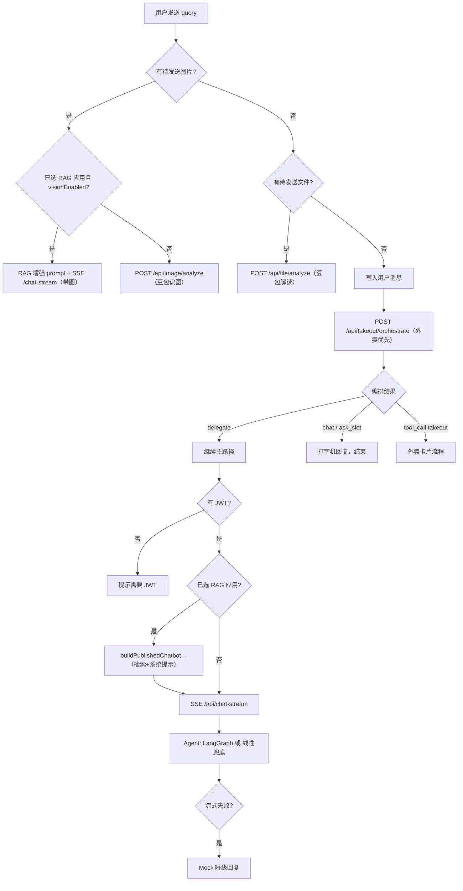

# Playground Query 路由梳理

入口主要是 `sendPrompt`（热词、回车、解释图片/文件）。按**优先级**判断，先命中先返回。

## 一、顶层分支（7 条主路径）

| # | 分支 | 触发条件 | API / 机制 | 与 RAG 关系 |
|---|------|----------|------------|-------------|
| 1 | **识图（独立）** | `pendingImage` 且未走 RAG+vision | `POST /api/image/analyze` | 不走 Agent |
| 2 | **识图 + RAG** | `pendingImage` + 已选假发布 Chatbot + `visionEnabled` | RAG 增强 prompt → `chat-stream` + `imageDataUrls` | 检索 + 多模态 Agent |
| 3 | **读文件** | `pendingFile` | `POST /api/file/analyze` | 不走 Agent；无「文件+RAG」分支 |
| 4 | **外卖编排** | 纯文本（**优先于 RAG**） | `POST /api/takeout/orchestrate` | 先编排，未命中再 RAG |
| 5 | **外卖快捷入口** | 点「外卖」快捷按钮 | 本地定时回复 + `isAwaitingTakeoutFollowup` | 不调 orchestrate |
| 6 | **RAG / 假发布 Chatbot** | 纯文本 + 已选 RAG + 外卖未接管 | `buildPublishedChatbotPlaygroundAugmentedPrompt` → `chat-stream` | 知识库检索拼 prompt |
| 7 | **默认 Agent 对话** | 纯文本 + orchestrate `delegate` + 有 JWT | `SSE /api/chat-stream` | 可选叠加 #6 |

守卫：无 JWT 时多数路径提示；外卖意图无 JWT 可能直接 `startTakeoutConversation()`。

## 二、外卖子分支（orchestrate 之后）

| 返回 action | 行为 |
|-------------|------|
| `delegate_chat_stream` | 交回 #7 默认 Agent |
| `chat` / `ask_slot` | 打字机回复 |
| `tool_call` (takeout) | `startTakeoutConversation` → 协议卡 / 菜品卡 / 授权 / 支付 |

编排实现：`takeoutOrchestratorService`（Doubao + `TAKEOUT_ORCHESTRATION_PROMPT`）；规则兜底见 `takeoutIntentService`。

## 三、RAG（假发布 Chatbot）

发送前改 prompt，非独立聊天 API：

1. `resolvePublishedChatbotForPlayground`（`mockPublished` + chat 模式）
2. 有 `datasetIds` → 知识库检索上下文
3. 系统提示 + 变量 + 用户问题
4. `sessionId` → `playground-{base}-chatbot-{appId}`

## 四、`/chat-stream` 服务端

| 层级 | 分支 |
|------|------|
| 记忆 | `createMemoryPlan` → timeline `plan` |
| Agent | `LANGGRAPH_ENABLED` → LangGraph；否则线性 plan→tool→reason |
| 兜底 | LangGraph 失败 → 线性；流式失败 → Mock |
| 工具 | `web_search`（需 `TAVILY_API_KEY`） |

## 五、快捷操作

| 入口 | 路径 |
|------|------|
| 热词 | `sendPrompt(topic)` |
| 图像/文件按钮 | 选择器 → #1–#3 |
| 外卖按钮 | 本地模拟，非 orchestrate |
| VariableSelect | 切换 RAG 应用 |

## 六、能力对照

| 能力 | 独立分支 | 说明 |
|------|----------|------|
| 外卖 | ✅ | 编排 + 卡片；**优先于 RAG** |
| RAG | ✅（增强层） | 叠在 chat-stream |
| 识图 | ✅ | 默认豆包；RAG+vision 走 Agent |
| 读文件 | ✅ | 仅 file analyze |
| 默认聊天 | ✅ | Agent + web_search |

相关代码：

- 前端路由：`hooks/useChatStreamController.ts` → `sendPrompt`
- 外卖编排 API：`apps/server/src/routes/chatRoutes.ts` → `/takeout/orchestrate`
- 编排服务：`apps/server/src/services/takeoutOrchestratorService.ts`
- 规则意图：`apps/server/src/services/takeoutIntentService.ts`
