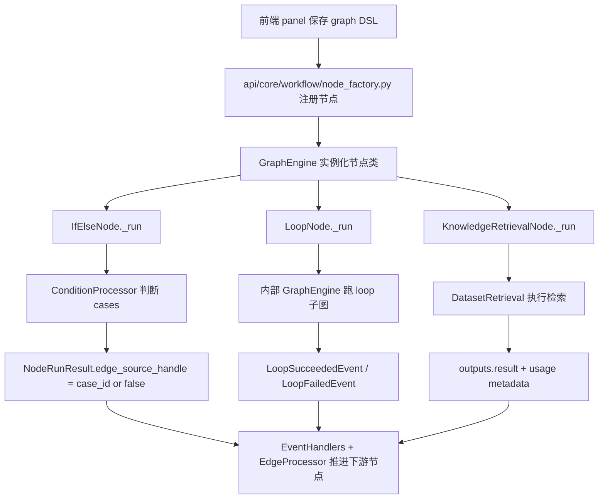

# If-Else / Loop / Knowledge Retrieval 后端执行梳理

这份文档专门补上前面几份说明里没有展开的部分：

- 前端 panel 只是配置节点 DSL
- 真正的 `if-else / loop / knowledge-retrieval` 运算发生在后端
- 后端如何读取前端保存的图配置并执行节点

这份文档的目标不是解释前端怎么画，而是回答一句更准确的话：

> `loop`、`if-else`、`knowledge-retrieval` 的真正计算和路由，核心都在 `api` 里的 workflow graph engine。

## 1. 先讲清前后端分工

前端负责：

- 编辑节点配置
- 保存 graph DSL
- 维护节点的画布结构和可视化字段
- 帮用户配置 `cases`、`dataset_ids`、`loop_variables`、`start_node_id` 这类数据

后端负责：

- 解析 graph DSL
- 实例化节点类
- 从变量池读取输入
- 执行条件判断 / 循环 / 检索
- 根据结果选择下一条边继续跑图

所以你前面看到的这些前端字段：

- `IfElse.cases`
- `KnowledgeRetrieval.dataset_ids`
- `Loop.start_node_id`
- `Loop.break_conditions`

在后端都会变成真正的执行输入，而不是只做展示。

## 2. 后端统一执行入口

虽然三个节点分布在不同目录，但执行入口是统一的。

### 2.1 节点注册

后端节点最终都通过 `api/core/workflow/node_factory.py` 注册。

关键点：

- `register_nodes()` 会导入 `dify_graph.nodes`
- 也会导入 `core.workflow.nodes`
- 然后通过 `Node.get_node_type_classes_mapping()` 拿到完整 registry

这意味着：

- `if-else` 和 `loop` 这类节点主要在 `dify_graph.nodes.*`
- `knowledge-retrieval` 目前在 `core.workflow.nodes.*`
- 但执行时它们都被统一当作 workflow node 来实例化

### 2.2 图执行器

统一运行时依赖 `dify_graph` 的图引擎。和本文最相关的几个角色是：

- `api/core/workflow/node_factory.py`
  - 负责解析 node type -> node class
- `api/dify_graph/graph_engine/event_management/event_handlers.py`
  - 负责处理节点执行成功/失败后的图推进
- `api/dify_graph/graph_engine/graph_traversal/edge_processor.py`
  - 负责按 branch handle 或普通边规则继续走图
- `api/dify_graph/node_events/base.py`
  - 定义统一的 `NodeRunResult`

### 2.3 后端看重的不是 panel，而是 graph_config

后端并不关心前端有哪些 React 组件。它真正消费的是前端保存下来的 graph DSL，也就是：

- `nodes`
- `edges`
- 每个节点 `data` 里的业务配置

所以复现时要注意：

- 前端组件不是后端执行依据
- 后端执行依据是最终保存下来的 node config 和 edge config

## 3. 统一执行数据结构：NodeRunResult

三个节点最终都要返回 `NodeRunResult`。

`api/dify_graph/node_events/base.py` 里最关键的字段是：

```python
class NodeRunResult(BaseModel):
    status: WorkflowNodeExecutionStatus
    inputs: Mapping[str, Any]
    process_data: Mapping[str, Any]
    outputs: Mapping[str, Any]
    metadata: Mapping[WorkflowNodeExecutionMetadataKey, Any]
    llm_usage: LLMUsage
    edge_source_handle: str = "source"
```

这里最关键的是 `edge_source_handle`。

它的含义是：

- 普通节点默认从 `source` 往下游走
- 分支节点可以显式指定“从哪个 source handle 出去”

`if-else` 的分支路由就是靠它完成的。

## 4. 图引擎是怎么根据结果继续跑的

`api/dify_graph/graph_engine/event_management/event_handlers.py` 里，节点成功后会：

1. 把 outputs 存回 variable pool
2. 判断这个节点是不是 `BRANCH`
3. 如果是 branch，就调用：

```python
self._edge_processor.handle_branch_completion(
    event.node_id,
    event.node_run_result.edge_source_handle,
)
```

4. 如果不是 branch，就走普通的 `process_node_success`

`api/dify_graph/graph_engine/graph_traversal/edge_processor.py` 则负责：

- 找到 `source_handle == selected_handle` 的边
- 标记选中边为 `TAKEN`
- 标记其他分支边为 `SKIPPED`
- 把下游 ready 的节点重新入队执行

也就是说，后端 branch route 的本质是：

```txt
node._run() -> NodeRunResult.edge_source_handle -> EdgeProcessor 选边 -> 下游节点入队
```

## 5. If-Else 后端执行链路

对应文件：

- `api/dify_graph/nodes/if_else/entities.py`
- `api/dify_graph/nodes/if_else/if_else_node.py`

### 5.1 后端消费什么数据

后端真正消费的是 `IfElseNodeData`。

它支持两种结构：

- 新结构：`cases`
- 旧结构：`conditions + logical_operator`

但从当前实现看，核心路径已经是 `cases`。

### 5.2 真正的条件判断在哪做

`IfElseNode._run()` 会使用：

```python
condition_processor = ConditionProcessor()
```

然后对每个 case 调：

```python
condition_processor.process_conditions(
    variable_pool=self.graph_runtime_state.variable_pool,
    conditions=case.conditions,
    operator=case.logical_operator,
)
```

这说明：

- 前端只是把条件配置成 `cases`
- 真正取变量、比较值、算 `and/or` 的是后端 `ConditionProcessor`

### 5.3 分支是怎么选出来的

后端会遍历 `cases`：

- 哪个 case 第一个算出 `final_result = True`
- 就把 `selected_case_id = case.case_id`
- 如果都不成立，就保持 `selected_case_id = "false"`

最后返回：

```python
NodeRunResult(
    status=SUCCEEDED,
    edge_source_handle=selected_case_id or "false",
    outputs={"result": final_result, "selected_case_id": selected_case_id},
)
```

所以前端那套：

- `case_id`
- `NodeSourceHandle.handleId`
- `edge.sourceHandle`

在后端真正落地成了：

- `selected_case_id`
- `NodeRunResult.edge_source_handle`
- `EdgeProcessor` 的选边依据

### 5.4 这说明什么

这说明 `if-else` 不只是前端画了多个出口。

真正的 branch route 是后端算出来的，前端只是负责把：

- case id
- 条件表达式
- edge source handle

按后端可执行的格式保存下去。

## 6. Loop 后端执行链路

对应文件：

- `api/dify_graph/nodes/loop/entities.py`
- `api/dify_graph/nodes/loop/loop_node.py`
- `api/dify_graph/nodes/loop/loop_start_node.py`
- `api/dify_graph/nodes/loop/loop_end_node.py`

### 6.1 Loop 是容器节点，不是普通节点

`LoopNode` 的定义是：

```python
execution_type = NodeExecutionType.CONTAINER
```

它和 `if-else` 的 `BRANCH` 不同，也和知识检索这种普通单步节点不同。

它本质上是：

- 自己先做一次容器级初始化
- 再反复驱动内部子图执行

### 6.2 Loop 后端真正依赖什么字段

Loop 后端最关键的输入是：

- `start_node_id`
- `loop_count`
- `break_conditions`
- `logical_operator`
- `loop_variables`

其中最关键的是 `start_node_id`，因为后端就是从这个内部起点启动循环体。

如果 `start_node_id` 不存在，`LoopNode._run()` 会直接报错：

```python
raise ValueError(f"field start_node_id in loop {self._node_id} not found")
```

这也说明前端初始化阶段自动补 `LoopStart` 和 `start_node_id` 不是装饰，而是后端执行前提。

### 6.3 Loop 变量不是展示字段，后端会写进 variable pool

`LoopNode._run()` 一开始会处理 `loop_variables`。

规则是：

- `value_type == constant` 时，把常量转成 segment
- `value_type == variable` 时，从 variable pool 取值
- 然后统一写回 variable pool，selector 是：

```txt
[loop_node_id, loop_variable.label]
```

所以前端面板里配的 loop variables，后端会真正变成循环上下文变量。

### 6.4 break condition 也是后端实时判断

Loop 后端同样使用 `ConditionProcessor` 去判断 `break_conditions`。

判断发生在两个时点：

1. 循环开始前先判断一次
2. 每一轮执行完后再判断一次

如果条件成立，就提前结束 loop。

这说明 LoopPanel 里的 break condition 不是前端辅助提示，而是后端实际终止循环的控制条件。

### 6.5 每一轮怎么跑

Loop 真正执行循环体的方式不是自己手写 while 里调用节点，而是：

1. 根据 `start_node_id` 创建一个新的子图执行器
2. 调 `_run_single_loop(graph_engine=..., current_index=i)`
3. 由这个内部 graph engine 从 `LoopStart` 开始把 loop 子图跑完

也就是说，Loop 的每一轮本质上是：

```txt
LoopNode 驱动一个内部 GraphEngine 去跑 loop 子图
```

### 6.6 LoopStart / LoopEnd 在后端的作用

`LoopStartNode` 和 `LoopEndNode` 自己几乎不做计算，只是简单返回成功：

```python
return NodeRunResult(status=WorkflowNodeExecutionStatus.SUCCEEDED)
```

但它们的语义很重要：

- `LoopStart` 是循环子图入口
- `LoopEnd` 是循环子图的 break 标记点之一

在 `_run_single_loop()` 里，如果执行事件里命中了 `LOOP_END` 成功，就会把 `reach_break_node = True`。

这表示：

- loop 不只是靠 break condition 停
- 还可以靠 loop 子图内部跑到 `LoopEnd` 来结束当前循环

### 6.7 Loop 会累积什么运行信息

`LoopNode` 执行时还会累积：

- 每轮耗时 `loop_duration_map`
- 每轮 loop variable 值 `single_loop_variable_map`
- 每轮子图产生的输出
- 全部 LLM usage

最后写到 `LoopSucceededEvent` / `StreamCompletedEvent` 的 metadata 里。

所以 loop 在后端不仅负责流程控制，也负责累计子图运行统计。

## 7. Knowledge Retrieval 后端执行链路

对应文件：

- `api/core/workflow/nodes/knowledge_retrieval/entities.py`
- `api/core/workflow/nodes/knowledge_retrieval/knowledge_retrieval_node.py`

### 7.1 这个节点和 if-else / loop 的一个区别

`if-else` 和 `loop` 在 `dify_graph.nodes`。

`knowledge-retrieval` 当前在：

```txt
api/core/workflow/nodes/knowledge_retrieval/
```

但它仍然通过 `core/workflow/node_factory.py` 注册进统一 node registry，所以执行时没有两套系统。

### 7.2 后端真正依赖什么字段

Knowledge Retrieval 后端消费的是：

- `query_variable_selector`
- `query_attachment_selector`
- `dataset_ids`
- `retrieval_mode`
- `single_retrieval_config`
- `multiple_retrieval_config`
- `metadata_filtering_mode`
- `metadata_filtering_conditions`
- `metadata_model_config`

这和前端 panel 里的编辑项是一一对应的。

### 7.3 真正的检索不是前端调的，是后端调的

`KnowledgeRetrievalNode._run()` 会先从 variable pool 取 query 和 attachments：

- query 必须是 `StringSegment`
- attachment 必须是 `ArrayFileSegment` 或 `FileSegment`

然后调用：

```python
self._fetch_dataset_retriever(node_data=self._node_data, variables=variables)
```

内部再转成 `KnowledgeRetrievalRequest`，最后交给：

```python
DatasetRetrieval().knowledge_retrieval(...)
```

这一步才是真正的知识库召回和 rerank。

### 7.4 single / multiple 模式在后端如何分流

后端根据 `retrieval_mode` 分成两条路径：

- `single`
  - 要求 `single_retrieval_config`
  - 用单模型检索参数构造请求
- `multiple`
  - 要求 `multiple_retrieval_config`
  - 处理 `top_k / score_threshold / reranking_mode / reranking_model / weights`

也就是说，前端切换模式不是只改表单显示，后端真的会走不同构造路径。

### 7.5 metadata filter 也在后端解析

Knowledge Retrieval 的 metadata filter 不只是原样透传。

后端会在 `_resolve_metadata_filtering_conditions()` 里：

- 对 condition value 做模板解析
- 从 variable pool 里展开变量
- 把字符串模板解析成最终值
- 再构造成真正传给 retrieval 的条件对象

所以 metadata filter 的表达式求值也发生在后端。

### 7.6 输出是什么

检索成功后，后端会把结果包装成：

```python
outputs = {
    "result": ArrayObjectSegment(...)
}
```

这和前端文档里看到的 output vars 对上了：

- 前端负责告诉用户这个节点会产出 `result`
- 后端真正产出 `result`

## 8. 一个统一视角：前端字段如何变成后端执行输入

### 8.1 If-Else

前端保存：

- `cases[].case_id`
- `cases[].conditions`
- edge 的 `sourceHandle`

后端执行：

- `ConditionProcessor` 计算 case
- 输出 `selected_case_id`
- 通过 `edge_source_handle` 选边继续跑图

### 8.2 Loop

前端保存：

- `start_node_id`
- `loop_variables`
- `break_conditions`
- `loop_count`

后端执行：

- 初始化 loop variable 到 variable pool
- 以 `start_node_id` 启动子图 graph engine
- 每轮后判断 break condition 或 `LoopEnd`

### 8.3 Knowledge Retrieval

前端保存：

- `dataset_ids`
- query selector
- retrieval config
- metadata filter

后端执行：

- 从 variable pool 取 query / attachment
- 构造 `KnowledgeRetrievalRequest`
- 调 `DatasetRetrieval.knowledge_retrieval()`

## 9. 三者统一后端执行图



## 10. 结合前端文档后，应该怎么理解这三类节点

### 10.1 If-Else

前端职责：

- 管理 `cases`
- 管理 handle 和 edge sourceHandle

后端职责：

- 真正求值每个 case
- 决定从哪条分支边继续跑

### 10.2 Loop

前端职责：

- 管理 loop variables、break conditions、loop start 结构

后端职责：

- 真正驱动每一轮循环
- 运行 loop 子图
- 判断是否中断

### 10.3 Knowledge Retrieval

前端职责：

- 管理检索配置和数据集选择

后端职责：

- 真正执行检索、rerank、metadata 过滤和输出生成

## 11. 复现时最关键的边界

如果你在别的项目里复现，最容易犯的错是把后端执行语义也塞进前端思维里。

正确拆法应该是：

1. 前端只负责生成后端能执行的 graph DSL。
2. 后端负责解释 DSL 并执行节点。
3. 分支、循环、检索的“真实求值”都应该在后端。

尤其是下面三点要守住：

1. `if-else` 的分支选择必须由后端返回 `edge_source_handle`。
2. `loop` 的每一轮应由后端驱动子图，而不是前端模拟循环。
3. `knowledge-retrieval` 的 query 解析、metadata filter 和检索调用必须在后端完成。

## 12. 一句话总结

前端的 `IfElsePanel / KnowledgeRetrievalPanel / LoopPanel` 负责“把配置写对”，后端的 `IfElseNode / KnowledgeRetrievalNode / LoopNode` 负责“把图真正跑起来”。

所以你说的这句是对的：

> `loop` 之类真正是在后端运算，前端只是配置和可视化。