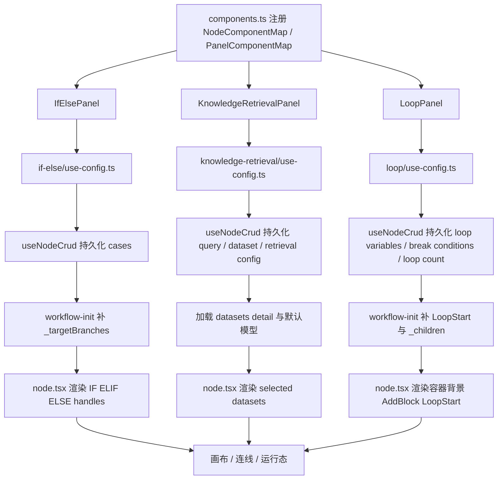

# KnowledgeRetrievalPanel 与 LoopPanel 梳理

这份文档接着前一份 `if-else` 说明，专门梳理 `components.ts` 里注册的这两个 panel：

- `KnowledgeRetrievalPanel`
- `LoopPanel`

目标是把它们的职责、状态流和复现要点讲清楚，方便在别的项目里照着拆。

## 1. 它们是怎么挂进工作流系统的

在 `components.ts` 里，两者都通过 `PanelComponentMap` 注册：

```ts
[BlockEnum.KnowledgeRetrieval]: KnowledgeRetrievalPanel,
[BlockEnum.Loop]: LoopPanel,
```

这说明它们都只是“右侧配置面板”，真正画布里的节点内容分别在：

- `knowledge-retrieval/node.tsx`
- `loop/node.tsx`

也就是说，复现时最先要保持的分层是：

- `node.tsx` 负责画布视觉
- `panel.tsx` 负责编辑配置
- `use-config.ts` 负责状态与副作用
- `default.ts` 负责默认值与校验

## 2. 两个 panel 的职责差异

虽然它们都叫 panel，但其实不是同一类东西。

### 2.1 KnowledgeRetrievalPanel

它的本质是“检索参数编排面板”，负责编辑：

- 查询文本来自哪个变量
- 查询附件来自哪个变量
- 选择哪些知识库
- 检索模式和 rerank 模型
- metadata 过滤条件
- 输出变量说明

它不负责结构控制，只负责一类节点的输入参数配置。

### 2.2 LoopPanel

它的本质是“循环容器配置面板”，负责编辑：

- Loop 内部可用的循环变量
- 中断循环的 break 条件
- 最大循环次数

它不是普通算子节点，而是一个“包裹子节点的容器节点”。因此它的 panel 除了改表单，还要和 loop 子图、start node、容器内部变量联动。

## 3. KnowledgeRetrievalPanel 是怎么实现的

### 3.1 panel.tsx 只负责装配 UI

`knowledge-retrieval/panel.tsx` 基本不做业务判断，只负责把 `useConfig` 返回的数据拼进几个子组件：

- `VarReferencePicker`
- `AddKnowledge`
- `DatasetList`
- `RetrievalConfig`
- `MetadataFilter`
- `OutputVars`

它的页面结构可以理解成四段：

1. 查询输入区
2. 知识库选择与检索参数区
3. metadata 过滤区
4. 输出变量说明区

### 3.2 查询输入区

这里有两个变量选择器：

- `query_variable_selector`
- `query_attachment_selector`

其中附件选择器不是一直显示，而是由 `showImageQueryVarSelector` 控制。这个值来自 `use-config.ts`，逻辑是：

- 只要已选数据集里有任意一个 `is_multimodal`
- 就显示查询附件输入

这意味着它不是纯 UI 开关，而是由“当前知识库能力”反向驱动表单显示。

### 3.3 知识库与检索配置区

这部分有两个核心组件：

- `DatasetList`: 展示当前已选数据集
- `RetrievalConfig`: 编辑检索模式与模型参数

旁边的 `AddKnowledge` 用于弹窗选择数据集。

`use-config.ts` 里，`handleOnDatasetsChange` 是这里的核心函数，它会同时处理：

- 更新 `dataset_ids`
- 根据新数据集重算 `multiple_retrieval_config`
- 如果新数据集都不是多模态，则清空 `query_attachment_selector`
- 更新 `datasetsDetailStore`
- 在混合数据集模式下自动打开 rerank model 设置弹窗

所以这里不是单纯“选中 ids”，而是一个带联动规则的数据编排器。

### 3.4 metadata 过滤区

这部分通过 `MetadataFilter` 管理，底层状态是：

- `metadata_filtering_mode`
- `metadata_filtering_conditions`
- `metadata_model_config`

`use-config.ts` 里专门提供了：

- `handleMetadataFilterModeChange`
- `handleAddCondition`
- `handleRemoveCondition`
- `handleUpdateCondition`
- `handleToggleConditionLogicalOperator`
- `handleMetadataModelChange`
- `handleMetadataCompletionParamsChange`

这里的 `metadataList` 也不是随便拼的，而是 `panel.tsx` 里对所有已选 dataset 的 `doc_metadata` 做交集，只有共同存在的 metadata 字段才允许参与过滤。

这个设计很重要，因为它避免了多数据集场景下某个 metadata key 只存在于部分数据集而导致条件无效。

### 3.5 输出变量说明区

`OutputVars` 这一块不是状态编辑，而是给后续节点提供“这个节点会产出什么”的静态说明。

当前输出主变量是：

```txt
result: Array[Object]
```

并带这些子字段：

- `content`
- `title`
- `url`
- `icon`
- `metadata`
- `files`

这类输出说明在复现时很值得保留，因为它直接决定后续变量选择器的用户理解成本。

## 4. KnowledgeRetrievalPanel 的状态流

`knowledge-retrieval/use-config.ts` 是它的核心。

### 4.1 useNodeCrud 负责持久化输入

面板编辑最终都落到：

```ts
const { inputs, setInputs } = useNodeCrud<KnowledgeRetrievalNodeType>(id, payload)
```

但这里做了一层包装：`setInputs` 会根据 `retrieval_mode` 自动清理无效字段。

规则是：

- `multiWay` 时删掉 `single_retrieval_config`
- `oneWay` 时删掉 `multiple_retrieval_config`

这一步很关键，它防止两套配置同时挂在节点上，造成提交结构混乱。

### 4.2 默认模型自动补齐

`use-config.ts` 有一段 `useEffect`，会根据当前 provider 和默认模型自动补齐：

- `single_retrieval_config.model`
- `multiple_retrieval_config`

也就是说，Knowledge Retrieval 不是等用户从零填完才可用，而是进入面板时就会自动带上系统默认模型。

### 4.3 与 Start 节点联动

这一点比较隐蔽。

`use-config.ts` 会通过：

```ts
const startNode = getBeforeNodesInSameBranch(id).find(node => node.data.type === BlockEnum.Start)
```

在 chat 模式下，如果当前还没选查询变量，就默认把：

```txt
[startNodeId, 'sys.query']
```

写入 `query_variable_selector`。

所以它和 `start` 节点并不是 handle 级联动，而是变量依赖联动。这个点和前一个 `if-else` 问题里讲的 branch handle 机制是两条不同的链路。

### 4.4 数据集详情加载

Knowledge Retrieval 的 node 和 panel 都依赖数据集详情，而不是只依赖 `dataset_ids`。

流程是：

1. panel 保存 `dataset_ids`
2. `use-config.ts` 首屏根据 ids 调 `fetchDatasets`
3. 把详情同步到 `selectedDatasets`
4. `knowledge-retrieval/node.tsx` 再从 `datasetsDetailStore` 里把 icon、name 渲染到节点上

所以如果你在别的项目复现，不要只存 id 然后直接渲染节点，否则节点侧的信息不够完整。

## 5. KnowledgeRetrievalPanel 的默认值与校验

`default.ts` 的默认值是：

```ts
{
  query_variable_selector: [],
  query_attachment_selector: [],
  dataset_ids: [],
  retrieval_mode: multiWay,
  multiple_retrieval_config: {
    top_k,
    score_threshold: undefined,
    reranking_enable: false,
  },
}
```

校验重点有三个：

1. 必须选择至少一个数据集
2. `oneWay` 模式下必须配置模型
3. `multiWay` 模式下如果数据集组合要求 rerank，则必须有 rerank model

这说明这个 panel 的校验不是“字段必填”这么简单，而是强依赖当前检索模式和数据集组合策略。

## 6. LoopPanel 是怎么实现的

### 6.1 panel.tsx 的 UI 结构

`loop/panel.tsx` 分成三块：

1. `loopVariables`
2. `breakCondition`
3. `loopMaxCount`

具体组件是：

- `LoopVariable`
- `ConditionWrap`
- `InputNumberWithSlider`

其中最值得注意的是，这里的 `ConditionWrap` 不是 `if-else` 目录那个，而是 loop 自己目录下的一套条件编辑组件，但设计思想基本一致。

### 6.2 loopVariables

这一段的作用是让 Loop 节点额外声明容器级变量。

面板顶部加号直接调用 `handleAddLoopVariable`，默认创建：

- 一个 uuid id
- 空 label
- `var_type = string`
- `value_type = constant`
- 空 value

这说明 loop variable 不是从子节点自动推导出来的，它是用户显式声明的一组循环上下文变量。

### 6.3 breakCondition

这部分本质上是一套“提前终止循环”的条件编辑器。

它复用了和 `if-else` 类似的条件模型：

- 条件列表
- `and / or`
- 子变量条件
- 文件属性判断

但语义和 `if-else` 不同：

- `if-else` 是多出口分支判断
- `loop` 是单一出口下的中断条件判断

所以 LoopPanel 不会去维护 `_targetBranches`，因为它没有多分支出口模型。

### 6.4 loopMaxCount

`InputNumberWithSlider` 修改的是 `inputs.loop_count`。

面板里会先做一次：

```ts
const roundedVal = Math.round(val)
```

再写回状态，确保 loop count 一定是整数。

这和 `default.ts` 里的校验配合在一起，保证：

- 是数字
- 是整数
- 范围在 `1 ~ LOOP_NODE_MAX_COUNT`

## 7. LoopPanel 的状态流

`loop/use-config.ts` 是 LoopPanel 的核心。

### 7.1 useNodeCrud 负责容器配置持久化

Loop 的表单数据也是通过 `useNodeCrud` 维护，但它和普通节点最大的区别是：它还要感知自身容器内部的子节点。

### 7.2 依赖 loop 子节点计算可用变量

这段很关键：

```ts
const loopChildrenNodes = [{ id, data: payload } as any, ...getLoopNodeChildren(id)]
const childrenNodeVars = toNodeOutputVars(loopChildrenNodes, ...)
```

也就是说，break condition 里能选的变量，不只是 loop 自己的字段，还包括 loop 容器内部子节点产出的变量。

这就是为什么 `ConditionWrap` 收到的是：

- `availableNodes={loopChildrenNodes}`
- `availableVars={childrenNodeVars}`

如果在别的项目复现时少了这层，用户就没法在 break condition 里引用循环体内节点的结果。

### 7.3 条件编辑和 if-else 很像，但语义不同

Loop 的这些 handler：

- `handleAddCondition`
- `handleRemoveCondition`
- `handleUpdateCondition`
- `handleToggleConditionLogicalOperator`
- `handleAddSubVariableCondition`
- `handleRemoveSubVariableCondition`
- `handleUpdateSubVariableCondition`
- `handleToggleSubVariableConditionLogicalOperator`

在实现上和 `if-else/use-config.ts` 非常接近，都是用 `immer` 直接改 `inputs`。

但它们编辑的是：

- `break_conditions`
- `logical_operator`

而不是 `cases`。

这是复现时值得借鉴的一点：

- 条件编辑器可以复用
- 但不要把“分支结构”和“中断条件结构”混成一个模型

### 7.4 loop variable 的增删改

LoopPanel 独有的三组操作是：

- `handleAddLoopVariable`
- `handleRemoveLoopVariable`
- `handleUpdateLoopVariable`

它们都只操作 `inputs.loop_variables`，不会去动 loop 容器内的真实节点结构。

这说明面板负责的是“运行参数”，不是“子图编辑”。

## 8. Loop 节点的特殊运行时结构

这一块如果不补，单看 panel 会不明白为什么 loop 这么特殊。

### 8.1 start_node_id

`LoopNodeType` 里有：

```ts
start_node_id: string
```

这表示 loop 子图的入口节点。

### 8.2 workflow-init 会自动补 LoopStart

`workflow-init.ts` 在初始化阶段会检查每个 Loop 节点：

- 如果没有 `start_node_id`
- 或者 `start_node_id` 指向的节点不是 `CUSTOM_LOOP_START_NODE`

就会自动创建一个 loop start node，并把 `start_node_id` 指过去。

所以 Loop 不是裸容器，它总是配一颗内部起始节点。

### 8.3 `_children`

初始化阶段还会把 loop 子节点列表挂到：

```ts
data._children
```

`loop/node.tsx` 会依据这个字段判断：

- 是否显示候选态的 `LoopStartNodeDumb`
- 当 `_children.length === 1` 时显示 `AddBlock`

这里的 `1` 基本表示当前只有内部 start node，还没有真正业务子节点。

### 8.4 结论

所以 LoopPanel 配的不是一个普通节点，而是一个“有内部子图的容器节点配置面板”。

## 9. LoopPanel 的默认值与校验

`default.ts` 给 Loop 的默认值是：

```ts
{
  start_node_id: '',
  break_conditions: [],
  loop_count: 10,
  _children: [],
  logical_operator: 'and',
}
```

校验逻辑主要有三类：

1. `loop_variables` 的 `label` 不能为空
2. `break_conditions` 的变量、操作符、值必须完整
3. `loop_count` 必须是合法整数且在上限范围内

因此 LoopPanel 的有效性取决于：

- 变量声明是否完整
- 中断条件是否完整
- 容器运行上限是否合理

## 10. 两个 panel 的共同点

虽然语义不同，但它们都遵守同一套前端节点设计：

1. `panel.tsx` 只做 UI 装配
2. `use-config.ts` 集中管理状态、副作用和联动
3. `default.ts` 负责默认值和 `checkValid`
4. `node.tsx` 只负责画布展示，不负责编辑逻辑

这是这套工作流节点最值得复用的架构约定。

## 11. 两个 panel 的关键差异

### 11.1 KnowledgeRetrievalPanel 更像“参数型节点”

它关心的是：

- 输入变量来源
- 外部资源选择
- 模型配置
- 检索过滤条件

节点本体没有复杂结构，只是把选中的 dataset 可视化出来。

### 11.2 LoopPanel 更像“容器型节点”

它关心的是：

- 容器内变量
- 容器中断条件
- 容器执行上限
- 容器内部子图入口与子节点

它本质上是一个带内部编排语义的节点，不是单纯表单节点。

## 12. 在其他项目复现时的最小建议

### 12.1 如果你要复现 KnowledgeRetrievalPanel

建议最少保留这些状态：

```ts
{
  queryVariable,
  queryAttachment,
  datasetIds,
  retrievalMode,
  retrievalConfig,
  metadataFilterMode,
  metadataConditions,
}
```

并保留这三条规则：

- 检索模式切换时清理另一套无效配置
- 数据集变化时联动更新配置和附件输入可见性
- metadata 字段只允许选择所有数据集共有字段

### 12.2 如果你要复现 LoopPanel

建议最少保留这些状态：

```ts
{
  startNodeId,
  loopVariables,
  breakConditions,
  logicalOperator,
  loopCount,
  _children,
}
```

并保留这三条规则：

- loop 容器要有内部 start node
- break condition 可引用容器内部子节点变量
- panel 只改容器配置，不直接改子图结构

## 13. 一句话总结

这两个 panel 看起来都只是右侧表单，但本质完全不同：

- `KnowledgeRetrievalPanel` 是“外部资源 + 检索策略”的参数配置器
- `LoopPanel` 是“带子图入口与运行约束”的容器配置器

如果你在别的项目里要复现，最重要的不是照抄组件，而是保住这两个节点的建模边界。

## 14. 和 IfElsePanel 放在一起看

前一份说明在 `if-else/README.md`，如果把三个节点放到一起看，差异会更清楚。

| 维度 | IfElsePanel | KnowledgeRetrievalPanel | LoopPanel |
| --- | --- | --- | --- |
| 节点类型 | 逻辑分支节点 | 参数型检索节点 | 容器型循环节点 |
| 核心持久化字段 | `cases` | `dataset_ids`、`retrieval_mode`、检索配置 | `loop_variables`、`break_conditions`、`loop_count` |
| 运行时附加字段 | `_targetBranches`、`_connectedSourceHandleIds` | `_datasets` | `_children`、`start_node_id` |
| panel 主要职责 | 编辑分支和条件 | 编辑查询源、数据集、检索与 metadata 规则 | 编辑循环变量、终止条件、次数上限 |
| node 主要职责 | 渲染多出口 handle | 渲染已选知识库卡片 | 渲染容器背景、内部 start、AddBlock |
| 是否多分支出口 | 是 | 否 | 否 |
| 是否依赖内部子图 | 否 | 否 | 是 |
| 是否依赖外部资源详情 | 否 | 是，依赖 dataset 详情 | 否 |
| 是否自动补运行态结构 | 是，补 `_targetBranches` | 是，补默认模型与 datasets detail | 是，补 `LoopStart` 与 `_children` |

### 14.1 三者最本质的区别

- `IfElsePanel` 解决的是“往哪条分支走”
- `KnowledgeRetrievalPanel` 解决的是“拿什么数据、用什么检索策略查”
- `LoopPanel` 解决的是“循环体怎么跑、什么时候停”

所以三者虽然都用了 `panel.tsx + use-config.ts + default.ts` 的骨架，但它们的建模中心完全不同：

- `if-else` 的中心是 branch
- `knowledge-retrieval` 的中心是 retrieval config
- `loop` 的中心是 container runtime

## 15. 三者统一状态流图

下面这张图把三类节点放到同一个视角里，重点看 `panel -> use-config -> useNodeCrud -> node/runtime` 这条主链路。



## 16. 复现时最值得抽象成公共能力的部分

如果你后面准备在别的项目里复刻这几类节点，建议优先抽公共层，而不是先抄每个节点的 JSX。

### 16.1 可以抽成公共层的能力

1. `NodeComponentMap / PanelComponentMap` 注册机制
2. `panel.tsx` 只装配、`use-config.ts` 管状态的分层
3. `useNodeCrud` 这类统一节点输入读写接口
4. `default.ts` 统一承载默认值和校验
5. 条件编辑器公共能力：变量选择、操作符切换、子变量条件

### 16.2 不要过早强行抽象的部分

1. `IfElse` 的 `_targetBranches`，因为它是多出口节点专用
2. `KnowledgeRetrieval` 的 dataset / rerank 联动，因为它强依赖业务域
3. `Loop` 的 `start_node_id + _children`，因为它是容器子图专用结构

## 17. 直接复现时的推荐拆法

如果你要在其他项目里快速落地，可以按下面顺序做，而不是三个节点一起上。

1. 先做参数型节点，优先复现 `KnowledgeRetrievalPanel` 这类单节点表单。
2. 再做逻辑分支节点，复现 `IfElsePanel` 的 `case_id = handleId = edge.sourceHandle` 规则。
3. 最后做容器型节点，复现 `LoopPanel` 的内部 start node 和 `_children` 机制。

## 18. 当前实现补充

目前 `KnowledgeRetrievalPanel` 在这个仓库里已经不是纯前端占位状态，而是补齐了两条真实链路：

1. 右侧 panel 内可直接管理知识库，支持新建、编辑、删除数据集。
2. 数据集来源改为服务端 `workflow/knowledge-datasets` API，而不是只读本地 seed。

这意味着当前节点的 `dataset_ids` 不再只是“演示配置”，而是能和服务端持久化目录保持同步；节点卡片上的 `_datasets` 摘要也会随着后端数据变更一起刷新。

这个顺序的原因是复杂度递增：

- 参数型节点主要是表单和副作用
- 分支节点多了 edge handle 约束
- 容器节点还要处理子图和运行时结构