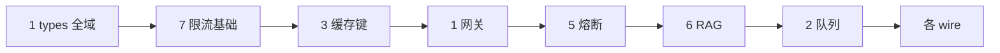

# AI Service 高并发落地计划

> 对照 [AI_Service.md](../local_docs/docs/AI_Service.md) · 细粒度 feat · **每项完成：`git add` + `git commit` + `pnpm --filter @kronos/server lint`（或 test）**  
> 原则：先 type / 单函数 / 通用函数，再接线；不堆未提交代码。

## 进度

| 域 | 计划 | 已完成 |
|----|------|--------|
| 1 网关调度 | 12 | 12 |
| 2 削峰排队 | 11 | 11 |
| 3 缓存复用 | 11 | 11 |
| 4 模型弹性 | 10 | 10 |
| 5 熔断降级 | 11 | 11 |
| 6 RAG 高并发 | 11 | 11 |
| 7 资源成本 | 11 | 11 |
| **合计** | **77** | **77** |

---

## 目录约定（新增代码根）

```text
apps/server/src/ai/
  types/           # 纯类型
  gateway/         # 模型路由、统一调用
  rateLimit/       # 限流
  cache/           # 缓存键与读写
  queue/           # 任务优先级、作业元数据
  circuit/         # 熔断、降级
  rag/             # 检索缓存、预热
  cost/            # Token 计量、并发会话
  middleware/      # Express 中间件
```

---

## 1. 流量接入 & 网关调度（12）

| ID | 粒度 | 交付物 | 状态 |
|----|------|--------|------|
| G-01 | type | `ModelProviderId`：`'doubao' \| 'openai' \| 'qwen' \| 'wenxin' \| 'spark' \| 'local'` | ✅ |
| G-02 | type | `ModelRouteIntent`：`'chat' \| 'embedding' \| 'vision' \| 'planning'` | ✅ |
| G-03 | type | `GatewayModelConfig`：provider、model、baseUrl、priority、maxConcurrency | ✅ |
| G-04 | type | `GatewayRequestContext`：userId、sessionId、intent、traceId | ✅ |
| G-05 | fn | `parseGatewayModelConfigs(env)`：从 `AI_GATEWAY_MODELS` JSON 解析配置列表 | ✅ |
| G-06 | fn | `selectGatewayModel(ctx, configs)`：按 intent + priority 选可用模型 | ✅ |
| G-07 | fn | `buildOpenAiCompatibleClient(config)`：统一 LangChain ChatOpenAI 构造 | ✅ |
| G-08 | fn | `resolveDefaultGatewayModel(intent)`：未配置时回退 `DOUBAO_*` | ✅ |
| G-09 | fn | `createGatewayInvokeHeaders(ctx)`：透传 trace / user 到上游 | ✅ |
| G-10 | middleware | `attachGatewayContext`：JWT sub → `GatewayRequestContext` | ✅ |
| G-11 | wire | `langchainChatService` 经 gateway 取 model（保持 mock 路径） | ✅ |
| G-12 | wire | `llmNodeDebugExecutor` 经 gateway 取 model | ✅ |

---

## 2. 请求削峰 & 异步排队（11）

| ID | 粒度 | 交付物 | 状态 |
|----|------|--------|------|
| Q-01 | type | `AiTaskKind`：`'chat' \| 'workflow_draft' \| 'image' \| 'embedding_batch'` | ✅ |
| Q-02 | type | `AiTaskStatus`：`'queued' \| 'running' \| 'succeeded' \| 'failed' \| 'cancelled'` | ✅ |
| Q-03 | type | `AiTaskRecord`：taskId、kind、priority、payload、status、progress | ✅ |
| Q-04 | type | `AiTaskPriority`：0–9 数值，付费用户加权常量 | ✅ |
| Q-05 | fn | `computeTaskPriority(ctx)`：user tier + kind → priority | ✅ |
| Q-06 | fn | `buildAiTaskJobId(kind, id)`：BullMQ jobId 规范化 | ✅ |
| Q-07 | fn | `shouldEnqueueChatTask(promptChars)`：超长 prompt 走异步阈值 | ✅ |
| Q-08 | store | `memoryAiTaskStore`：create/get/patch 内存任务表 | ✅ |
| Q-09 | fn | `enqueueAiTask(record)`：复用 Redis + BullMQ（与 workflow 队列并列） | ✅ |
| Q-10 | route | `POST /api/ai/tasks` 创建任务、`GET /api/ai/tasks/:id` 轮询 | ✅ |
| Q-11 | wire | chat-stream 超阈值返回 `202` + taskId，SSE 改拉 task events | ✅ |

---

## 3. 缓存复用（11）

| ID | 粒度 | 交付物 | 状态 |
|----|------|--------|------|
| C-01 | type | `CacheLayer`：`'prompt' \| 'retrieval' \| 'model_result'` | ✅ |
| C-02 | type | `CacheEntry<T>`：key、value、expiresAt、hitCount | ✅ |
| C-03 | fn | `hashCacheKey(layer, parts)`：sha256 稳定键 | ✅ |
| C-04 | fn | `buildPromptCacheKey(prompt, model, temperature)` | ✅ |
| C-05 | fn | `buildRetrievalCacheKey(query, datasetIds, topK)` | ✅ |
| C-06 | store | `memoryCacheStore`：get/set/delete + TTL | ✅ |
| C-07 | store | `redisCacheStore`：可选 Redis 实现（`AI_CACHE_REDIS=1`） | ✅ |
| C-08 | fn | `getCacheStore()`：按 env 选 memory/redis | ✅ |
| C-09 | fn | `evictExpiredEntries(store)`：冷热清理入口 | ✅ |
| C-10 | wire | `runKnowledgeRetrievalQuery` 读/写 retrieval 缓存 | ✅ |
| C-11 | wire | chat-stream 命中 prompt 缓存直接 SSE 回放 | ✅ |

---

## 4. 模型弹性 & 混合部署（10）

| ID | 粒度 | 交付物 | 状态 |
|----|------|--------|------|
| M-01 | type | `ModelTier`：`'small' \| 'large' \| 'local'` | ✅ |
| M-02 | type | `ModelRouteRule`：maxPromptTokens、intent、tier | ✅ |
| M-03 | fn | `estimatePromptTier(tokenCount)`：简单/复杂分流 | ✅ |
| M-04 | fn | `pickModelTierByTokens(tokens, rules)` | ✅ |
| M-05 | fn | `filterConfigsByTier(configs, tier)` | ✅ |
| M-06 | fn | `mergeBatchPrompts(items, maxChars)`：短请求合并占位 | ✅ |
| M-07 | fn | `splitBatchResults(raw)`：批量响应拆条 | ✅ |
| M-08 | env | `AI_LOCAL_MODEL_BASE_URL` 本地 OpenAI 兼容端点 | ✅ |
| M-09 | wire | gateway `selectGatewayModel` 接入 tier 规则 | ✅ |
| M-10 | test | tier 分流单测（<500 token → small） | ✅ |

---

## 5. 熔断降级 & 故障自愈（11）

| ID | 粒度 | 交付物 | 状态 |
|----|------|--------|------|
| F-01 | type | `CircuitState`：`'closed' \| 'open' \| 'half_open'` | ✅ |
| F-02 | type | `CircuitBreakerConfig`：failureThreshold、openMs、halfOpenProbe | ✅ |
| F-03 | fn | `createCircuitBreaker(name, config)`：内存状态机 | ✅ |
| F-04 | fn | `recordCircuitSuccess(name)` / `recordCircuitFailure(name)` | ✅ |
| F-05 | fn | `isCircuitOpen(name)` | ✅ |
| F-06 | fn | `selectFallbackModel(primary, configs)`：主模型 open 时切备 | ✅ |
| F-07 | type | `DegradePolicy`：disableCoT、maxToolSteps、maxOutputTokens | ✅ |
| F-08 | fn | `resolveDegradePolicy(loadPercent)`：高峰降级策略 | ✅ |
| F-09 | fn | `invokeWithRetry(fn, { maxAttempts, backoffMs })` | ✅ |
| F-10 | fn | `fallbackReplyText(code)`：统一兜底文案表 | ✅ |
| F-11 | wire | gateway 调用包裹 circuit + retry + fallback 文案 | ✅ |

---

## 6. RAG 高并发检索（11）

| ID | 粒度 | 交付物 | 状态 |
|----|------|--------|------|
| R-01 | type | `RetrievalCacheKeyParts`：query、datasetIds、method、topK | ✅ |
| R-02 | fn | `shardDatasetId(datasetId)`：分片键（预留多实例） | ✅ |
| R-03 | fn | `runParallelRetrievalPaths(paths, fn)`：Promise.all 包装 | ✅ |
| R-04 | fn | `scoreKeywordPath(chunks, terms)`：抽离关键词路 | ✅ |
| R-05 | fn | `scoreSemanticPath(chunks, vectors)`：抽离语义路 | ✅ |
| R-06 | fn | `mergeRetrievalPaths(results, weights)`：多路融合 | ✅ |
| R-07 | fn | `warmDatasetChunks(datasetId)`：预热加载 chunks 入内存 LRU | ✅ |
| R-08 | store | `chunkWarmCache`：datasetId → chunks 条目 + TTL | ✅ |
| R-09 | fn | `getCachedRetrieval(key)` / `setCachedRetrieval(key, items)` | ✅ |
| R-10 | wire | `knowledgeRetrievalService` 并行路径 + 检索缓存 | ✅ |
| R-11 | route | `POST /api/knowledge/datasets/:id/warm` 管理预热 | ✅ |

---

## 7. 资源管控 & 成本（11）

| ID | 粒度 | 交付物 | 状态 |
|----|------|--------|------|
| T-01 | type | `RateLimitScope`：`'user' \| 'session' \| 'token_budget' \| 'concurrent_session'` | ✅ |
| T-02 | type | `RateLimitResult`：allowed、remaining、retryAfterMs | ✅ |
| T-03 | fn | `createTokenBucket(key, capacity, refillPerSec)` | ✅ |
| T-04 | fn | `consumeTokenBucket(bucket, cost)` | ✅ |
| T-05 | fn | `checkUserRateLimit(userId, scope)` | ✅ |
| T-06 | fn | `checkSessionRateLimit(sessionId)` | ✅ |
| T-07 | fn | `acquireConcurrentSessionSlot(userId, max)` / `release` | ✅ |
| T-08 | fn | `recordTokenUsage(userId, { input, output, model })` | ✅ |
| T-09 | fn | `isOverGlobalTokenQuota()`：日配额熔断 | ✅ |
| T-10 | middleware | `aiRateLimitMiddleware`：chat-stream / ai/tasks 入口 | ✅ |
| T-11 | wire | 超限返回 429 + `Retry-After`，记 usage 到 memory/redis | ✅ |

---

## 执行顺序（推荐）



1. **批次 A**：G-01～G-04、T-01～T-02、C-01～C-02、Q-01～Q-02、F-01～F-02、R-01、M-01（纯 type，约 12 commit）
2. **批次 B**：哈希/限流/熔断/缓存单函数（约 20 commit）
3. **批次 C**：store + middleware（约 10 commit）
4. **批次 D**：wire 现有 chat / RAG / workflow（约 15 commit）

---

## Commit 模板

```bash
git add -A && git commit -m "feat(server): <ID> <简短说明>"
pnpm --filter @kronos/server lint
```

---

## 变更日志

| 日期 | Commit | ID |
|------|--------|-----|
| 2026-05-21 | `5d1cd21` | PLAN |
| 2026-05-21 | `82f601f`…`784f3d3` | 批次 A |
| 2026-05-21 | `2534639`…`b972b10` | 批次 B/C/D（C/F/Q/T/G wire） |
| 2026-05-21 | `628de97`…`3e2a406` | 批次 M/R 全部完成 |
| 2026-05-21 | — | **77/77 完成** |
